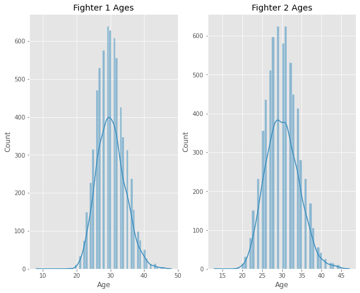
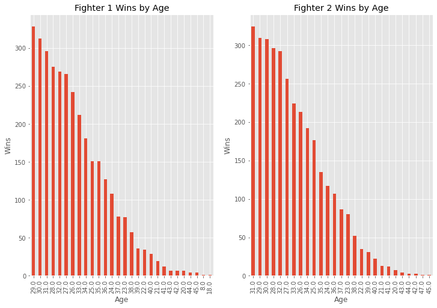
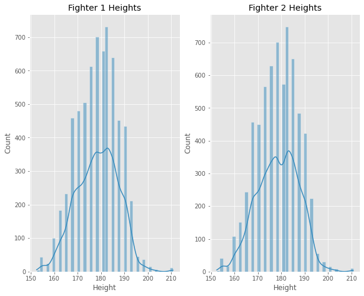
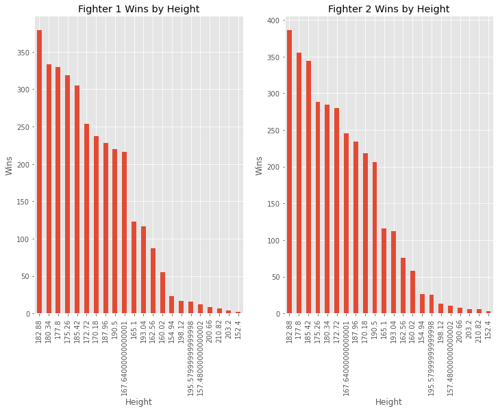
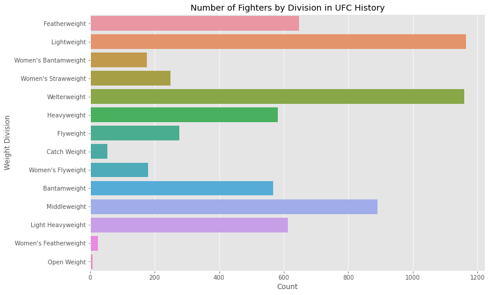
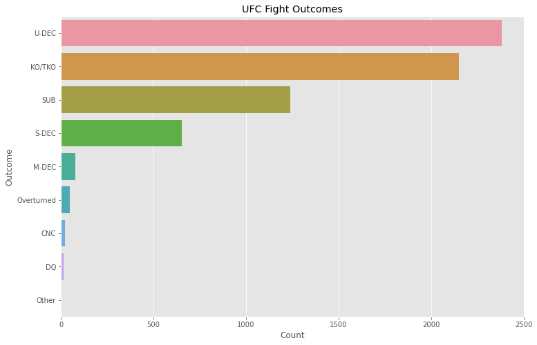
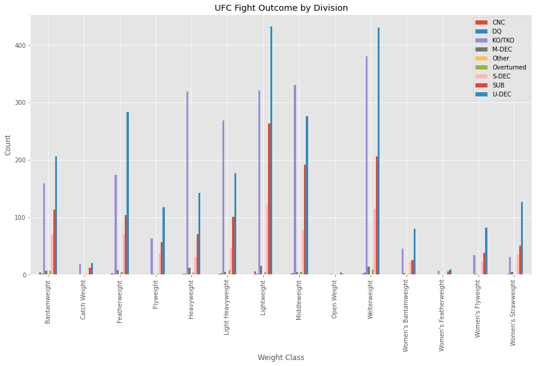
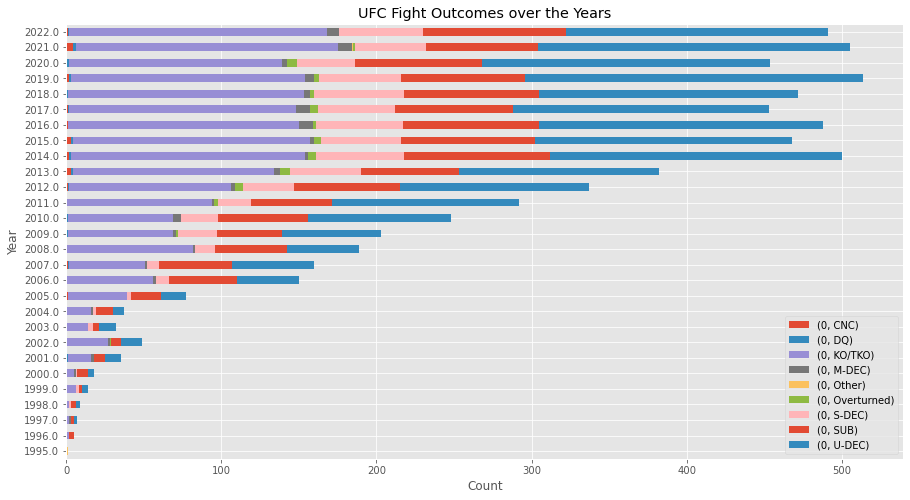
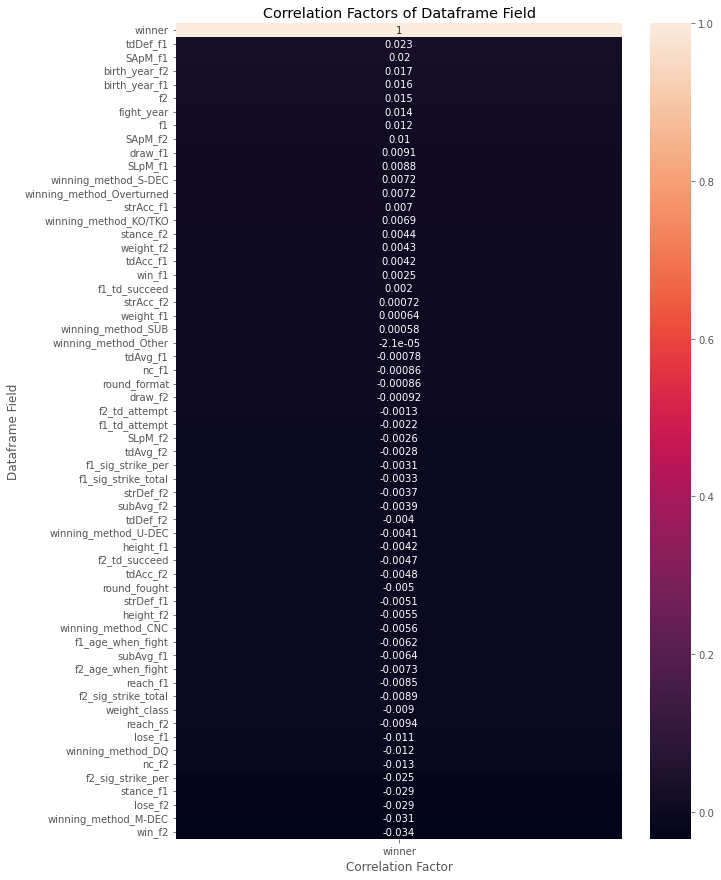

# Analyzing UFC Data and Statistics

MMA is a rapidly growing sport in which participants, referred to as fighters, utilize various martial arts such as jiu jitsu, muay thai, kickboxing, wrestling, judo, karate, taw kwon do, and many more in an attempt to beat their opponent either by (unanimous, split, or majority) decision (UD/SD/MD), knockout/technical knockout (KO/TKO), or submission (SUB). Decisions are decided when a finish (KO/TKO or SUB) doesn't occur through the length of the fight in which a winner is chosen based on the scorecards of a panel of three judges. A unanimous decision, as per the name, is when all three judges agree on the winner, a split decision is when two out of the three judges agree and the third scored the fight for the losing fighter, and a majority decision is when two judges agree on a winner and the third scored it a draw. Although rare, a split draw can occur in a fight where all three judges scored the fight evenly, or in an instance where two judges scored the fight for opposing fighters and the third judge scored a draw.

The UFC happens to be the most popular mixed martial arts (MMA) promotion and has gone from a taboo cage-fighting organization to a world-reknown and respected sports-entertainment corporation. Like any other sport, statistical analysis and data science play a huge role in determining not only betting odds, props, and moneylines for events, but also in the UFC's matchmakers' jobs of setting up fights.

The aim of this tutorial is to organize and analyze UFC statistics in order to see what qualities or attributes may contribute and correlate to winning fights the most.

### Import Statements:

Below are all the imports utilized throughout this tutorial. The third-party libraries' documentations can be found at their respective website: [pandas](https://pandas.pydata.org/pandas-docs/stable/), [numpy](https://docs.scipy.org/doc/numpy/user/), [matplotlib](https://matplotlib.org/contents.html), [scikit-learn](http://scikit-learn.org/stable/documentation.html), and [seaborn](https://seaborn.pydata.org/). In addition, the popular matplotlib style ["ggplot"](https://matplotlib.org/stable/gallery/style_sheets/ggplot.html) that mimics the [ggplot style in R](https://ggplot2.tidyverse.org/) is used for aesthetic sugar.


```python
import pandas as pd
import numpy as np
import matplotlib.pyplot as plt
%matplotlib inline
from scipy.stats import f
import seaborn as sns
from sklearn import model_selection
from sklearn import linear_model
from sklearn import preprocessing
from sklearn.preprocessing import StandardScaler, LabelEncoder
from sklearn.model_selection import train_test_split, KFold, RandomizedSearchCV
from sklearn.metrics import accuracy_score
from xgboost import XGBClassifier as xgb
from IPython.display import display, FileLink
from datetime import datetime
import random
import re
import warnings
warnings.filterwarnings('ignore')

plt.style.use('ggplot')
```

## Data Collection + Parsing

The data I'll be utilizing was obtained from scraping the statistics found on [ufcstats.com](https://www.ufcstats.com). Alternatively, pre-assembled data sets can be found across the internet, but many of these data sets aren't completely up-to-date, which is what manually scraping the data allowed me to ensure. Using scrapy and a couple custom spider scripts, I was able to get two data sets, one representing fighter stats by individual and the other representing fight stats by fight card (also referred to as event). Both of these CSV files as well as the zipped folders containing the scrapy scripts, instructions, etc. can be found below. As the instructions for scraping the data are found in the README files of the spiders, that won't be separately touched on in this tutorial.

*Additional UFC stats and data that are also up-to-date but organized differently can be found in the [github repo](https://github.com/KieranCanter/CMSC320FinalProject/tree/gh-pages) for this tutorial.*


```python
display(FileLink('fighters.csv', result_html_prefix="Fighter Data: "))
display(FileLink('fightCards.csv', result_html_prefix="Fight Card Data: "))
display(FileLink('fighterSpider.zip', result_html_prefix="Fighter Spider: "))
display(FileLink('fightcardsSpider.zip', result_html_prefix="Fight Card Spider: "))
```


Fighter Data: <a href='fighters.csv' target='_blank'>fighters.csv</a><br>


Fight Card Data: <a href='fightCards.csv' target='_blank'>fightCards.csv</a><br>


Fighter Spider: <a href='fighterSpider.zip' target='_blank'>fighterSpider.zip</a><br>


Fight Card Spider: <a href='fightcardsSpider.zip' target='_blank'>fightcardsSpider.zip</a><br>


## Data Management/Representation

### Preprocessing the Data

We first start with preprocessing the data, which includes cleaning and reorganizing the data as a pandas dataframe so that it's more readable, accessible, and so that it only contains the most relevant information we are going to utilize. Below you can see the first five rows of each dataframe along with the column headers.


```python
df_fighters = pd.read_csv('fighters.csv')
df_cards = pd.read_csv('fightCards.csv')
display(df_fighters.head())
display(df_cards.head())
```


<div>
<style scoped>
    .dataframe tbody tr th:only-of-type {
        vertical-align: middle;
    }

    .dataframe tbody tr th {
        vertical-align: top;
    }

    .dataframe thead th {
        text-align: right;
    }
</style>
<table border="1" class="dataframe">
  <thead>
    <tr style="text-align: right;">
      <th></th>
      <th>DoB</th>
      <th>SApM</th>
      <th>SLpM</th>
      <th>height</th>
      <th>name</th>
      <th>reach</th>
      <th>record</th>
      <th>stance</th>
      <th>strAcc</th>
      <th>strDef</th>
      <th>subAvg</th>
      <th>tdAcc</th>
      <th>tdAvg</th>
      <th>tdDef</th>
      <th>weight</th>
    </tr>
  </thead>
  <tbody>
    <tr>
      <th>0</th>
      <td>Nov 24 1985</td>
      <td>3.72</td>
      <td>1.65</td>
      <td>5' 9"</td>
      <td>John Gunther</td>
      <td>72.0</td>
      <td>5-1-0</td>
      <td>Orthodox</td>
      <td>37%</td>
      <td>46%</td>
      <td>0.0</td>
      <td>42%</td>
      <td>7.08</td>
      <td>0%</td>
      <td>155</td>
    </tr>
    <tr>
      <th>1</th>
      <td>Jul 05 1995</td>
      <td>2.80</td>
      <td>1.93</td>
      <td>6' 0"</td>
      <td>Joe Giannetti</td>
      <td>74.0</td>
      <td>6-1-0</td>
      <td>Southpaw</td>
      <td>38%</td>
      <td>40%</td>
      <td>0.0</td>
      <td>16%</td>
      <td>1.00</td>
      <td>0%</td>
      <td>155</td>
    </tr>
    <tr>
      <th>2</th>
      <td>Aug 25 1974</td>
      <td>0.92</td>
      <td>0.92</td>
      <td>5' 8"</td>
      <td>Allen Berube</td>
      <td>NaN</td>
      <td>4-3-0</td>
      <td>Orthodox</td>
      <td>80%</td>
      <td>33%</td>
      <td>3.4</td>
      <td>100%</td>
      <td>6.87</td>
      <td>0%</td>
      <td>155</td>
    </tr>
    <tr>
      <th>3</th>
      <td>Nov 27 1991</td>
      <td>4.49</td>
      <td>3.80</td>
      <td>5' 11"</td>
      <td>Daichi Abe</td>
      <td>71.0</td>
      <td>6-2-0</td>
      <td>Orthodox</td>
      <td>33%</td>
      <td>56%</td>
      <td>0.0</td>
      <td>50%</td>
      <td>0.33</td>
      <td>0%</td>
      <td>170</td>
    </tr>
    <tr>
      <th>4</th>
      <td>Jun 26 1996</td>
      <td>6.18</td>
      <td>6.43</td>
      <td>5' 7"</td>
      <td>Diana Belbita</td>
      <td>68.0</td>
      <td>14-7-0</td>
      <td>Orthodox</td>
      <td>42%</td>
      <td>50%</td>
      <td>0.0</td>
      <td>50%</td>
      <td>0.63</td>
      <td>68%</td>
      <td>115</td>
    </tr>
  </tbody>
</table>
</div>


<div>
<style scoped>
    .dataframe tbody tr th:only-of-type {
        vertical-align: middle;
    }

    .dataframe tbody tr th {
        vertical-align: top;
    }

    .dataframe thead th {
        text-align: right;
    }
</style>
<table border="1" class="dataframe">
  <thead>
    <tr style="text-align: right;">
      <th></th>
      <th>card_name</th>
      <th>f1</th>
      <th>f1_sig_strike_per</th>
      <th>f1_sig_strike_total</th>
      <th>f1_td_attempt</th>
      <th>f1_td_succeed</th>
      <th>f2</th>
      <th>f2_sig_strike_per</th>
      <th>f2_sig_strike_total</th>
      <th>f2_td_attempt</th>
      <th>f2_td_succeed</th>
      <th>fight_date</th>
      <th>fights_location</th>
      <th>round_format</th>
      <th>round_fought</th>
      <th>weight_class</th>
      <th>winner</th>
      <th>winning_method</th>
    </tr>
  </thead>
  <tbody>
    <tr>
      <th>0</th>
      <td>UFC Fight Night: Gane vs. Volkov</td>
      <td>Charles Rosa</td>
      <td>28%</td>
      <td>182</td>
      <td>2</td>
      <td>2</td>
      <td>Justin Jaynes</td>
      <td>47%</td>
      <td>92</td>
      <td>2</td>
      <td>2</td>
      <td>June 26 2021</td>
      <td>Las Vegas, Nevada, USA</td>
      <td>3</td>
      <td>3</td>
      <td>Featherweight</td>
      <td>Charles Rosa</td>
      <td>S-DEC</td>
    </tr>
    <tr>
      <th>1</th>
      <td>UFC Fight Night: Gane vs. Volkov</td>
      <td>Damir Hadzovic</td>
      <td>47%</td>
      <td>219</td>
      <td>2</td>
      <td>2</td>
      <td>Yancy Medeiros</td>
      <td>51%</td>
      <td>237</td>
      <td>3</td>
      <td>2</td>
      <td>June 26 2021</td>
      <td>Las Vegas, Nevada, USA</td>
      <td>3</td>
      <td>3</td>
      <td>Lightweight</td>
      <td>Damir Hadzovic</td>
      <td>U-DEC</td>
    </tr>
    <tr>
      <th>2</th>
      <td>UFC Fight Night: Font vs. Garbrandt</td>
      <td>Damir Ismagulov</td>
      <td>47%</td>
      <td>63</td>
      <td>1</td>
      <td>0</td>
      <td>Rafael Alves</td>
      <td>44%</td>
      <td>126</td>
      <td>3</td>
      <td>2</td>
      <td>May 22 2021</td>
      <td>Las Vegas, Nevada, USA</td>
      <td>3</td>
      <td>3</td>
      <td>Lightweight</td>
      <td>Damir Ismagulov</td>
      <td>U-DEC</td>
    </tr>
    <tr>
      <th>3</th>
      <td>UFC Fight Night: Gane vs. Volkov</td>
      <td>Julia Avila</td>
      <td>52%</td>
      <td>91</td>
      <td>4</td>
      <td>1</td>
      <td>Julija Stoliarenko</td>
      <td>42%</td>
      <td>94</td>
      <td>3</td>
      <td>1</td>
      <td>June 26 2021</td>
      <td>Las Vegas, Nevada, USA</td>
      <td>3</td>
      <td>3</td>
      <td>Women's Bantamweight</td>
      <td>Julia Avila</td>
      <td>SUB</td>
    </tr>
    <tr>
      <th>4</th>
      <td>UFC Fight Night: Hall vs. Strickland</td>
      <td>Jinh Yu Frey</td>
      <td>47%</td>
      <td>185</td>
      <td>1</td>
      <td>0</td>
      <td>Ashley Yoder</td>
      <td>38%</td>
      <td>236</td>
      <td>8</td>
      <td>0</td>
      <td>July 31 2021</td>
      <td>Las Vegas, Nevada, USA</td>
      <td>3</td>
      <td>3</td>
      <td>Women's Strawweight</td>
      <td>Jinh Yu Frey</td>
      <td>U-DEC</td>
    </tr>
  </tbody>
</table>
</div>


Let's go over what each of these column headers mean:

| Fighter Data || Fight Card Data ||
|:--------------|:--|:----------------|:--|
| DoB | Date of birth | card_name | Name of the card/event |
| SApM | Significant strikes absorbed per minute | f1 | Fighter 1 |
| SLpM | Significant strikes landed per minute | f1_sig_strike_per | Fighter 1's significant strike percentage |
| Height | Height of fighter | f1_sig_strike_total | Fighter 1's total significant strikes |
| Name | Name of fighter | f1_td_attempt | # of takedown attempts from fighter 1 |
| Reach | Wingspan (inches) | f1_td_succeed | # of successful takedowns from fighter 1 |
| Record | Professional fight record | f2 | Fighter 2 |
| Stance | Fighter's preferred stance | f2_sig_strike_per | Fighter 2's significant strike percentage |
| strAcc | Significant striking accuracy | f2_sig_strike_total | Fighter 2's total significant strikes |
| strDef | Significant strike defence | f2_td_attempt | # of takedown attempts from fighter 2 |
| subAvg | Average submissions attempted per 15 minutes | f2_td_succeed | # of successful takedowns from fighter 2 |
| tdAcc | Takedown accuracy | fight_date | Date of fight |
| tdAvg | Average takedowns landed per 15 minutes | fights_location | Location of fight |
| tdDef | Takedown defence (% of opponent TD attempts that did not succeed) | round_format | Max # of rounds to be fought |
| Weight | Most previously fought weight class | round_fought | # of rounds fought |
| | | weight_class | Weight class of bout |
| | | winner | Winning fighter |
| | | winning_method | Method of victory |

Now let's see if there's any missing data we need to take care of.


```python
df_fighters.isnull().sum()
```


    DoB          0
    SApM         0
    SLpM         0
    height       0
    name         0
    reach     1919
    record       0
    stance     819
    strAcc       0
    strDef       0
    subAvg       0
    tdAcc        0
    tdAvg        0
    tdDef        0
    weight       0
    dtype: int64


As you can see, there are a ton of missing values for reach and stance. We will get to this in a moment, but let's check the other dataframe also.


```python
df_cards.isnull().sum()
```


    card_name              0
    f1                     0
    f1_sig_strike_per      0
    f1_sig_strike_total    0
    f1_td_attempt          0
    f1_td_succeed          0
    f2                     0
    f2_sig_strike_per      0
    f2_sig_strike_total    0
    f2_td_attempt          0
    f2_td_succeed          0
    fight_date             0
    fights_location        0
    round_format           0
    round_fought           0
    weight_class           0
    winner                 0
    winning_method         0
    dtype: int64


Perfect! There aren't any missing values we have to tend to in the fight cards dataframe. Finally, let's check to see if there are any fighters with the same name that we should differentiate between.


```python
df_fighters[df_fighters.duplicated(subset='name', keep=False)]
```


<div>
<style scoped>
    .dataframe tbody tr th:only-of-type {
        vertical-align: middle;
    }

    .dataframe tbody tr th {
        vertical-align: top;
    }

    .dataframe thead th {
        text-align: right;
    }
</style>
<table border="1" class="dataframe">
  <thead>
    <tr style="text-align: right;">
      <th></th>
      <th>DoB</th>
      <th>SApM</th>
      <th>SLpM</th>
      <th>height</th>
      <th>name</th>
      <th>reach</th>
      <th>record</th>
      <th>stance</th>
      <th>strAcc</th>
      <th>strDef</th>
      <th>subAvg</th>
      <th>tdAcc</th>
      <th>tdAvg</th>
      <th>tdDef</th>
      <th>weight</th>
    </tr>
  </thead>
  <tbody>
    <tr>
      <th>281</th>
      <td>Feb 06 1965</td>
      <td>0.40</td>
      <td>0.00</td>
      <td>5' 11"</td>
      <td>Michael McDonald</td>
      <td>NaN</td>
      <td>1-1-0</td>
      <td>Orthodox</td>
      <td>0%</td>
      <td>50%</td>
      <td>0.0</td>
      <td>0%</td>
      <td>0.00</td>
      <td>0%</td>
      <td>205</td>
    </tr>
    <tr>
      <th>615</th>
      <td>Jan 15 1991</td>
      <td>2.76</td>
      <td>2.69</td>
      <td>5' 9"</td>
      <td>Michael McDonald</td>
      <td>70.0</td>
      <td>17-4-0</td>
      <td>Orthodox</td>
      <td>42%</td>
      <td>57%</td>
      <td>1.4</td>
      <td>66%</td>
      <td>1.09</td>
      <td>52%</td>
      <td>135</td>
    </tr>
    <tr>
      <th>1384</th>
      <td>--</td>
      <td>4.73</td>
      <td>2.00</td>
      <td>6' 1"</td>
      <td>Tony Johnson</td>
      <td>NaN</td>
      <td>11-3-0</td>
      <td>NaN</td>
      <td>53%</td>
      <td>31%</td>
      <td>0.0</td>
      <td>22%</td>
      <td>2.00</td>
      <td>0%</td>
      <td>265</td>
    </tr>
    <tr>
      <th>1389</th>
      <td>May 02 1983</td>
      <td>3.67</td>
      <td>4.00</td>
      <td>6' 2"</td>
      <td>Tony Johnson</td>
      <td>76.0</td>
      <td>7-2-0</td>
      <td>Orthodox</td>
      <td>92%</td>
      <td>22%</td>
      <td>0.0</td>
      <td>0%</td>
      <td>0.00</td>
      <td>90%</td>
      <td>205</td>
    </tr>
    <tr>
      <th>2276</th>
      <td>Oct 07 1992</td>
      <td>6.20</td>
      <td>5.83</td>
      <td>6' 0"</td>
      <td>Mike Davis</td>
      <td>72.0</td>
      <td>10-2-0</td>
      <td>Orthodox</td>
      <td>52%</td>
      <td>56%</td>
      <td>0.2</td>
      <td>53%</td>
      <td>3.04</td>
      <td>69%</td>
      <td>155</td>
    </tr>
    <tr>
      <th>2393</th>
      <td>--</td>
      <td>0.00</td>
      <td>0.00</td>
      <td>--</td>
      <td>Mike Davis</td>
      <td>NaN</td>
      <td>2-0-0</td>
      <td>NaN</td>
      <td>0%</td>
      <td>0%</td>
      <td>0.0</td>
      <td>0%</td>
      <td>0.00</td>
      <td>0%</td>
      <td>--</td>
    </tr>
    <tr>
      <th>2720</th>
      <td>Aug 29 1989</td>
      <td>3.33</td>
      <td>3.73</td>
      <td>5' 10"</td>
      <td>Joey Gomez</td>
      <td>71.0</td>
      <td>7-1-0</td>
      <td>Orthodox</td>
      <td>49%</td>
      <td>50%</td>
      <td>0.0</td>
      <td>28%</td>
      <td>2.00</td>
      <td>0%</td>
      <td>155</td>
    </tr>
    <tr>
      <th>2881</th>
      <td>Jul 21 1986</td>
      <td>4.46</td>
      <td>2.44</td>
      <td>5' 10"</td>
      <td>Joey Gomez</td>
      <td>73.0</td>
      <td>6-2-0</td>
      <td>Orthodox</td>
      <td>28%</td>
      <td>55%</td>
      <td>0.0</td>
      <td>100%</td>
      <td>0.62</td>
      <td>50%</td>
      <td>135</td>
    </tr>
    <tr>
      <th>3239</th>
      <td>Mar 16 1990</td>
      <td>3.23</td>
      <td>2.98</td>
      <td>5' 4"</td>
      <td>Bruno Silva</td>
      <td>65.0</td>
      <td>12-5-2 (1 NC)</td>
      <td>Orthodox</td>
      <td>46%</td>
      <td>58%</td>
      <td>0.0</td>
      <td>31%</td>
      <td>2.89</td>
      <td>64%</td>
      <td>125</td>
    </tr>
    <tr>
      <th>3364</th>
      <td>Jul 13 1989</td>
      <td>4.58</td>
      <td>4.31</td>
      <td>6' 0"</td>
      <td>Bruno Silva</td>
      <td>74.0</td>
      <td>22-8-0</td>
      <td>Orthodox</td>
      <td>48%</td>
      <td>44%</td>
      <td>0.0</td>
      <td>18%</td>
      <td>0.66</td>
      <td>71%</td>
      <td>185</td>
    </tr>
  </tbody>
</table>
</div>


As you can see, there are five different names across these ten fighters. Let's fix this issue first. We'll add the weight class to one of every two of these fighters to differentiate them and avoid duplicates. Since the Mike Davis entry with a record of 2-0-0 is missing all of the associated data, we'll just drop him.


```python
df_fighters.iloc[446, 4] = "Michael McDonald 135"
df_fighters.iloc[1318, 4] = "Tony Johnson 265"
df_fighters.iloc[2092, 4] = "Joey Gomez 155"
df_fighters.iloc[3300, 4] = "Bruno Silva 185"
df_fighters.drop([2404], inplace=True)
```

To make things arithmetically easier, we'll convert all the percentages (string objects) to decimal values.


```python
def per2dec(df, columns):
    for col in columns:
        df[col] = df[col].str.strip('%')
        df[col] = pd.to_numeric(df[col]) / 100

per2dec(df_fighters, ['strAcc', 'strDef', 'tdAcc', 'tdDef'])
df_fighters.head()
```


<div>
<style scoped>
    .dataframe tbody tr th:only-of-type {
        vertical-align: middle;
    }

    .dataframe tbody tr th {
        vertical-align: top;
    }

    .dataframe thead th {
        text-align: right;
    }
</style>
<table border="1" class="dataframe">
  <thead>
    <tr style="text-align: right;">
      <th></th>
      <th>DoB</th>
      <th>SApM</th>
      <th>SLpM</th>
      <th>height</th>
      <th>name</th>
      <th>reach</th>
      <th>record</th>
      <th>stance</th>
      <th>strAcc</th>
      <th>strDef</th>
      <th>subAvg</th>
      <th>tdAcc</th>
      <th>tdAvg</th>
      <th>tdDef</th>
      <th>weight</th>
    </tr>
  </thead>
  <tbody>
    <tr>
      <th>0</th>
      <td>Nov 24 1985</td>
      <td>3.72</td>
      <td>1.65</td>
      <td>5' 9"</td>
      <td>John Gunther</td>
      <td>72.0</td>
      <td>5-1-0</td>
      <td>Orthodox</td>
      <td>0.37</td>
      <td>0.46</td>
      <td>0.0</td>
      <td>0.42</td>
      <td>7.08</td>
      <td>0.00</td>
      <td>155</td>
    </tr>
    <tr>
      <th>1</th>
      <td>Jul 05 1995</td>
      <td>2.80</td>
      <td>1.93</td>
      <td>6' 0"</td>
      <td>Joe Giannetti</td>
      <td>74.0</td>
      <td>6-1-0</td>
      <td>Southpaw</td>
      <td>0.38</td>
      <td>0.40</td>
      <td>0.0</td>
      <td>0.16</td>
      <td>1.00</td>
      <td>0.00</td>
      <td>155</td>
    </tr>
    <tr>
      <th>2</th>
      <td>Aug 25 1974</td>
      <td>0.92</td>
      <td>0.92</td>
      <td>5' 8"</td>
      <td>Allen Berube</td>
      <td>NaN</td>
      <td>4-3-0</td>
      <td>Orthodox</td>
      <td>0.80</td>
      <td>0.33</td>
      <td>3.4</td>
      <td>1.00</td>
      <td>6.87</td>
      <td>0.00</td>
      <td>155</td>
    </tr>
    <tr>
      <th>3</th>
      <td>Nov 27 1991</td>
      <td>4.49</td>
      <td>3.80</td>
      <td>5' 11"</td>
      <td>Daichi Abe</td>
      <td>71.0</td>
      <td>6-2-0</td>
      <td>Orthodox</td>
      <td>0.33</td>
      <td>0.56</td>
      <td>0.0</td>
      <td>0.50</td>
      <td>0.33</td>
      <td>0.00</td>
      <td>170</td>
    </tr>
    <tr>
      <th>4</th>
      <td>Jun 26 1996</td>
      <td>6.18</td>
      <td>6.43</td>
      <td>5' 7"</td>
      <td>Diana Belbita</td>
      <td>68.0</td>
      <td>14-7-0</td>
      <td>Orthodox</td>
      <td>0.42</td>
      <td>0.50</td>
      <td>0.0</td>
      <td>0.50</td>
      <td>0.63</td>
      <td>0.68</td>
      <td>115</td>
    </tr>
  </tbody>
</table>
</div>


All of our fighter stat percentages are now decimals! Next, for all the fighters missing a substantial amount of data, which we will define as having 0 strDef, tdAvg, tdAcc, tdDef, and subAvg, we will simply remove them.


```python
df_fighters_clean = df_fighters.loc[~(
    (df_fighters["strDef"] == 0) &
    (df_fighters["tdAvg"] == 0) &
    (df_fighters["tdAcc"] == 0) &
    (df_fighters["tdDef"] == 0) &
    (df_fighters["subAvg"] == 0))].copy()
```

Something to be mindful of is noise in your data. Often times, fighters with no DoB in their statistics page means they've only fought one match in the UFC and are no longer with the organization and/or they fought in the very early days of the promotion. The sport has changed drastically since the 90's/early 2000's, so keeping these fighters in the dataframe may just cause more noise than it would benefit us. While we're at it, we'll strip the birth date entries to include just the year the fighter was born since the exact month and day aren't significant.


```python
df_fighters_clean = df_fighters_clean[~(df_fighters_clean['DoB'] == '--')].copy()

def get_birth_year(dob):
    return datetime.strptime(dob, '%b %d %Y').year

df_fighters_clean['birth_year'] = df_fighters_clean['DoB'].apply(lambda x: get_birth_year(x))
df_fighters_clean.drop(['DoB'], inplace=True, axis=1)
```

Another minor tweak we'll make is setting the index of the dataframe as the name column.


```python
df_fighters_clean.set_index('name', inplace=True)
df_fighters_clean.head()
```


<div>
<style scoped>
    .dataframe tbody tr th:only-of-type {
        vertical-align: middle;
    }

    .dataframe tbody tr th {
        vertical-align: top;
    }

    .dataframe thead th {
        text-align: right;
    }
</style>
<table border="1" class="dataframe">
  <thead>
    <tr style="text-align: right;">
      <th></th>
      <th>SApM</th>
      <th>SLpM</th>
      <th>height</th>
      <th>reach</th>
      <th>record</th>
      <th>stance</th>
      <th>strAcc</th>
      <th>strDef</th>
      <th>subAvg</th>
      <th>tdAcc</th>
      <th>tdAvg</th>
      <th>tdDef</th>
      <th>weight</th>
      <th>birth_year</th>
    </tr>
    <tr>
      <th>name</th>
      <th></th>
      <th></th>
      <th></th>
      <th></th>
      <th></th>
      <th></th>
      <th></th>
      <th></th>
      <th></th>
      <th></th>
      <th></th>
      <th></th>
      <th></th>
      <th></th>
    </tr>
  </thead>
  <tbody>
    <tr>
      <th>John Gunther</th>
      <td>3.72</td>
      <td>1.65</td>
      <td>5' 9"</td>
      <td>72.0</td>
      <td>5-1-0</td>
      <td>Orthodox</td>
      <td>0.37</td>
      <td>0.46</td>
      <td>0.0</td>
      <td>0.42</td>
      <td>7.08</td>
      <td>0.00</td>
      <td>155</td>
      <td>1985</td>
    </tr>
    <tr>
      <th>Joe Giannetti</th>
      <td>2.80</td>
      <td>1.93</td>
      <td>6' 0"</td>
      <td>74.0</td>
      <td>6-1-0</td>
      <td>Southpaw</td>
      <td>0.38</td>
      <td>0.40</td>
      <td>0.0</td>
      <td>0.16</td>
      <td>1.00</td>
      <td>0.00</td>
      <td>155</td>
      <td>1995</td>
    </tr>
    <tr>
      <th>Allen Berube</th>
      <td>0.92</td>
      <td>0.92</td>
      <td>5' 8"</td>
      <td>NaN</td>
      <td>4-3-0</td>
      <td>Orthodox</td>
      <td>0.80</td>
      <td>0.33</td>
      <td>3.4</td>
      <td>1.00</td>
      <td>6.87</td>
      <td>0.00</td>
      <td>155</td>
      <td>1974</td>
    </tr>
    <tr>
      <th>Daichi Abe</th>
      <td>4.49</td>
      <td>3.80</td>
      <td>5' 11"</td>
      <td>71.0</td>
      <td>6-2-0</td>
      <td>Orthodox</td>
      <td>0.33</td>
      <td>0.56</td>
      <td>0.0</td>
      <td>0.50</td>
      <td>0.33</td>
      <td>0.00</td>
      <td>170</td>
      <td>1991</td>
    </tr>
    <tr>
      <th>Diana Belbita</th>
      <td>6.18</td>
      <td>6.43</td>
      <td>5' 7"</td>
      <td>68.0</td>
      <td>14-7-0</td>
      <td>Orthodox</td>
      <td>0.42</td>
      <td>0.50</td>
      <td>0.0</td>
      <td>0.50</td>
      <td>0.63</td>
      <td>0.68</td>
      <td>115</td>
      <td>1996</td>
    </tr>
  </tbody>
</table>
</div>


Now finally we'll revisit the problem of missing values we had before. Reach is a pretty crucial physical trait that can have a big effect on the outcome of a fight. We need to figure out a way to deal with these missing values.

As with other physical characteristics like foot size, hand size, inseam, etc., wingspan has a lot to do with the height of the individual. While not perfect, we can estimate a reach value that's as statistically probable as possible by calculating the median reaches of every height (5'0", 5'1", ...) and attributing that median to the reach value of each fighter that's missing said value.


```python
median_wingspans = df_fighters_clean.groupby('height')['reach'].median()
display(median_wingspans)

df_fighters_clean['reach'] = df_fighters_clean['reach'].fillna(df_fighters_clean['height'].map(median_wingspans))

print("There are still {} missing reach values".format(df_fighters_clean['reach'].isna().sum()))
```


    height
    --        70.0
    5' 0"     61.5
    5' 1"     62.0
    5' 10"    72.0
    5' 11"    73.0
    5' 2"     63.0
    5' 3"     64.0
    5' 4"     65.0
    5' 5"     66.0
    5' 6"     67.0
    5' 7"     69.0
    5' 8"     70.0
    5' 9"     71.0
    6' 0"     74.0
    6' 1"     75.0
    6' 10"     NaN
    6' 11"    84.0
    6' 2"     75.0
    6' 3"     77.0
    6' 4"     78.0
    6' 5"     79.0
    6' 6"     79.0
    6' 7"     80.0
    6' 8"     80.0
    7' 2"      NaN
    7' 5"      NaN
    Name: reach, dtype: float64


    There are still 5 missing reach values


As seen from the output above, we still have 5 missing reach values. Compared to the 1919 that we started with, that's a substantial decrease. Since 5 is so insignificant to the gross total number of entries we have, we can just drop these entries.


```python
df_fighters_clean.dropna(subset=['reach'], inplace=True)
```

As for the missing stance values, these aren't as weighted in determining the outcome of a fight and are normally just fighter preference. We'll replace these by just getting a percentage of each stance out of the total 


```python
display(df_fighters_clean.groupby('stance')['stance'].count())
stance_total = df_fighters_clean.groupby('stance')['stance'].count().sum()

print("There are {} total stance entries".format(stance_total))

display(df_fighters_clean.groupby('stance')['stance'].count() / stance_total)
```


    stance
    Open Stance       5
    Orthodox       2060
    Sideways          1
    Southpaw        477
    Switch          154
    Name: stance, dtype: int64


    There are 2697 total stance entries


    stance
    Open Stance    0.001854
    Orthodox       0.763812
    Sideways       0.000371
    Southpaw       0.176863
    Switch         0.057100
    Name: stance, dtype: float64


We've calculated the decimal values that represent the percentage of each stance's frequency relative to the total. Using those as weights, we'll replace the missing stance values with one of the existing stances based on those decimal percentages. 

As a demo, you can see a list of 50 random choices. Unsurprisingly, orthodox comes up the most frequently, with some southpaw, swithc, and the occasional open stance if RNG permits.


```python
stance_list = ["Open Stance", "Orthodox", "Sideways", "Southpaw", "Switch"]
weight_list = [0.001854, 0.763812, 0.000371, 0.176863, 0.057100]

df_fighters_clean['stance'].fillna(random.choices(stance_list, weights=weight_list, k = 1)[0], inplace=True)

print(random.choices(stance_list, weights=weight_list, k = 50))
```

    ['Southpaw', 'Orthodox', 'Southpaw', 'Switch', 'Southpaw', 'Orthodox', 'Orthodox', 'Southpaw', 'Switch', 'Orthodox', 'Orthodox', 'Southpaw', 'Orthodox', 'Orthodox', 'Orthodox', 'Orthodox', 'Orthodox', 'Orthodox', 'Orthodox', 'Southpaw', 'Orthodox', 'Orthodox', 'Orthodox', 'Orthodox', 'Southpaw', 'Southpaw', 'Southpaw', 'Orthodox', 'Orthodox', 'Southpaw', 'Orthodox', 'Orthodox', 'Orthodox', 'Orthodox', 'Orthodox', 'Orthodox', 'Orthodox', 'Southpaw', 'Orthodox', 'Orthodox', 'Southpaw', 'Southpaw', 'Orthodox', 'Orthodox', 'Orthodox', 'Orthodox', 'Orthodox', 'Orthodox', 'Orthodox', 'Orthodox']


Wonderful! We have no more missing values, right? Let's check to be sure. 


```python
display(df_fighters_clean.isnull().sum())
df_fighters_clean[df_fighters_clean['height'] == '--']
```


    SApM          0
    SLpM          0
    height        0
    reach         0
    record        0
    stance        0
    strAcc        0
    strDef        0
    subAvg        0
    tdAcc         0
    tdAvg         0
    tdDef         0
    weight        0
    birth_year    0
    dtype: int64


<div>
<style scoped>
    .dataframe tbody tr th:only-of-type {
        vertical-align: middle;
    }

    .dataframe tbody tr th {
        vertical-align: top;
    }

    .dataframe thead th {
        text-align: right;
    }
</style>
<table border="1" class="dataframe">
  <thead>
    <tr style="text-align: right;">
      <th></th>
      <th>SApM</th>
      <th>SLpM</th>
      <th>height</th>
      <th>reach</th>
      <th>record</th>
      <th>stance</th>
      <th>strAcc</th>
      <th>strDef</th>
      <th>subAvg</th>
      <th>tdAcc</th>
      <th>tdAvg</th>
      <th>tdDef</th>
      <th>weight</th>
      <th>birth_year</th>
    </tr>
    <tr>
      <th>name</th>
      <th></th>
      <th></th>
      <th></th>
      <th></th>
      <th></th>
      <th></th>
      <th></th>
      <th></th>
      <th></th>
      <th></th>
      <th></th>
      <th></th>
      <th></th>
      <th></th>
    </tr>
  </thead>
  <tbody>
    <tr>
      <th>Amador Ramirez</th>
      <td>2.07</td>
      <td>4.93</td>
      <td>--</td>
      <td>70.0</td>
      <td>5-4-0</td>
      <td>Orthodox</td>
      <td>0.51</td>
      <td>0.69</td>
      <td>0.0</td>
      <td>0.33</td>
      <td>1.00</td>
      <td>0.00</td>
      <td>135</td>
      <td>1990</td>
    </tr>
    <tr>
      <th>Matt Ricehouse</th>
      <td>4.80</td>
      <td>3.70</td>
      <td>--</td>
      <td>70.0</td>
      <td>6-1-0</td>
      <td>Orthodox</td>
      <td>0.44</td>
      <td>0.47</td>
      <td>0.0</td>
      <td>0.22</td>
      <td>1.00</td>
      <td>0.81</td>
      <td>155</td>
      <td>1987</td>
    </tr>
    <tr>
      <th>Logan Nail</th>
      <td>2.27</td>
      <td>1.93</td>
      <td>--</td>
      <td>70.0</td>
      <td>1-1-0</td>
      <td>Orthodox</td>
      <td>0.51</td>
      <td>0.39</td>
      <td>0.0</td>
      <td>0.00</td>
      <td>0.00</td>
      <td>0.37</td>
      <td>185</td>
      <td>1989</td>
    </tr>
    <tr>
      <th>Lee Higgins</th>
      <td>3.68</td>
      <td>1.02</td>
      <td>--</td>
      <td>70.0</td>
      <td>2-1-0</td>
      <td>Orthodox</td>
      <td>0.26</td>
      <td>0.40</td>
      <td>0.0</td>
      <td>0.00</td>
      <td>0.00</td>
      <td>0.00</td>
      <td>155</td>
      <td>1980</td>
    </tr>
    <tr>
      <th>Hiroshi Izumi</th>
      <td>2.65</td>
      <td>1.95</td>
      <td>--</td>
      <td>70.0</td>
      <td>4-2-0</td>
      <td>Orthodox</td>
      <td>0.37</td>
      <td>0.66</td>
      <td>0.5</td>
      <td>0.70</td>
      <td>3.35</td>
      <td>1.00</td>
      <td>205</td>
      <td>1982</td>
    </tr>
    <tr>
      <th>Neal Ewing</th>
      <td>1.93</td>
      <td>2.27</td>
      <td>--</td>
      <td>70.0</td>
      <td>6-0-0</td>
      <td>Orthodox</td>
      <td>0.60</td>
      <td>0.48</td>
      <td>0.0</td>
      <td>0.62</td>
      <td>5.00</td>
      <td>0.00</td>
      <td>185</td>
      <td>1985</td>
    </tr>
    <tr>
      <th>TJ Cook</th>
      <td>3.18</td>
      <td>2.30</td>
      <td>--</td>
      <td>70.0</td>
      <td>13-5-0</td>
      <td>Orthodox</td>
      <td>0.47</td>
      <td>0.54</td>
      <td>0.0</td>
      <td>0.50</td>
      <td>1.01</td>
      <td>0.00</td>
      <td>205</td>
      <td>1982</td>
    </tr>
    <tr>
      <th>Joe Duarte</th>
      <td>4.00</td>
      <td>2.27</td>
      <td>--</td>
      <td>70.0</td>
      <td>10-4-0</td>
      <td>Orthodox</td>
      <td>0.38</td>
      <td>0.53</td>
      <td>1.0</td>
      <td>0.50</td>
      <td>3.00</td>
      <td>0.69</td>
      <td>155</td>
      <td>1977</td>
    </tr>
    <tr>
      <th>Billy Goff</th>
      <td>4.15</td>
      <td>9.95</td>
      <td>--</td>
      <td>70.0</td>
      <td>8-2-0</td>
      <td>Switch</td>
      <td>0.45</td>
      <td>0.59</td>
      <td>0.0</td>
      <td>0.50</td>
      <td>8.29</td>
      <td>1.00</td>
      <td>170</td>
      <td>1998</td>
    </tr>
    <tr>
      <th>Edward Faaloloto</th>
      <td>6.25</td>
      <td>2.28</td>
      <td>--</td>
      <td>70.0</td>
      <td>2-5-0</td>
      <td>Orthodox</td>
      <td>0.32</td>
      <td>0.44</td>
      <td>0.0</td>
      <td>0.25</td>
      <td>1.01</td>
      <td>0.33</td>
      <td>155</td>
      <td>1984</td>
    </tr>
    <tr>
      <th>Bryan Travers</th>
      <td>3.93</td>
      <td>2.33</td>
      <td>--</td>
      <td>70.0</td>
      <td>15-4-0</td>
      <td>Orthodox</td>
      <td>0.48</td>
      <td>0.55</td>
      <td>0.0</td>
      <td>0.28</td>
      <td>2.00</td>
      <td>0.63</td>
      <td>155</td>
      <td>1983</td>
    </tr>
    <tr>
      <th>Maka Watson</th>
      <td>1.60</td>
      <td>0.93</td>
      <td>--</td>
      <td>70.0</td>
      <td>4-2-0</td>
      <td>Orthodox</td>
      <td>0.37</td>
      <td>0.22</td>
      <td>0.0</td>
      <td>1.00</td>
      <td>2.00</td>
      <td>0.33</td>
      <td>155</td>
      <td>1984</td>
    </tr>
  </tbody>
</table>
</div>


It turns out we still have some missing height data that wasn't caught before because it's replaced with "--" strings. After some research, most of these fighters can be found to have a height of 5'7", so we'll simply use that number to replace the few missing values we have. We'll then convert height from feet and inches to centimeters since that's a more convenient metric to mathematically work with.


```python
df_fighters_clean['height'].replace({"--": "5\' 7\""}, inplace=True)

# Method to convert feet'inches" to cm
def convert_to_cm(height):
    if height is np.NaN:
        return height
    elif len(height.split("'")) == 2:
        feet = float(height.split("'")[0])
        inches = int(height.split("'")[1].replace(' ', '').replace('"',''))
        return (feet * 30.48) + (inches * 2.54)
    else:
        return float(height.replace('"','')) * 2.54

df_fighters_clean['height'] = df_fighters_clean['height'].apply(convert_to_cm)
```

Since we had disguised missing values in the height column, let's check to see if there are any in the weight column.


```python
df_fighters_clean[df_fighters_clean['weight'] == '--']
```


<div>
<style scoped>
    .dataframe tbody tr th:only-of-type {
        vertical-align: middle;
    }

    .dataframe tbody tr th {
        vertical-align: top;
    }

    .dataframe thead th {
        text-align: right;
    }
</style>
<table border="1" class="dataframe">
  <thead>
    <tr style="text-align: right;">
      <th></th>
      <th>SApM</th>
      <th>SLpM</th>
      <th>height</th>
      <th>reach</th>
      <th>record</th>
      <th>stance</th>
      <th>strAcc</th>
      <th>strDef</th>
      <th>subAvg</th>
      <th>tdAcc</th>
      <th>tdAvg</th>
      <th>tdDef</th>
      <th>weight</th>
      <th>birth_year</th>
    </tr>
    <tr>
      <th>name</th>
      <th></th>
      <th></th>
      <th></th>
      <th></th>
      <th></th>
      <th></th>
      <th></th>
      <th></th>
      <th></th>
      <th></th>
      <th></th>
      <th></th>
      <th></th>
      <th></th>
    </tr>
  </thead>
  <tbody>
  </tbody>
</table>
</div>


Great, the dataframe is empty, which means there are no missing weight values.

Next we'll split up the record so it's more integer friendly. We'll have to specify a new method to split the no contest outcomes because they are encaptured in parentheses, unlike the win-loss-draw numbers. After creating the appropriate columns, we'll drop the defunct record column.


```python
df_fighters_clean['record'] = df_fighters_clean['record'].str.replace(' \(', '-(', regex=True)
df_fighters_clean[['win', 'lose', 'draw', 'nc']] = df_fighters_clean['record'].str.split('-', expand=True)

def split_nc(nc):
    return re.findall(r"\d+", nc, re.IGNORECASE)[0]
    
df_fighters_clean['nc'] = df_fighters_clean['nc'].apply(lambda x: split_nc(x) if x is not None else 0)
df_fighters_clean.drop(['record'], axis=1, inplace=True)

df_fighters_clean.head()
```


<div>
<style scoped>
    .dataframe tbody tr th:only-of-type {
        vertical-align: middle;
    }

    .dataframe tbody tr th {
        vertical-align: top;
    }

    .dataframe thead th {
        text-align: right;
    }
</style>
<table border="1" class="dataframe">
  <thead>
    <tr style="text-align: right;">
      <th></th>
      <th>SApM</th>
      <th>SLpM</th>
      <th>height</th>
      <th>reach</th>
      <th>stance</th>
      <th>strAcc</th>
      <th>strDef</th>
      <th>subAvg</th>
      <th>tdAcc</th>
      <th>tdAvg</th>
      <th>tdDef</th>
      <th>weight</th>
      <th>birth_year</th>
      <th>win</th>
      <th>lose</th>
      <th>draw</th>
      <th>nc</th>
    </tr>
    <tr>
      <th>name</th>
      <th></th>
      <th></th>
      <th></th>
      <th></th>
      <th></th>
      <th></th>
      <th></th>
      <th></th>
      <th></th>
      <th></th>
      <th></th>
      <th></th>
      <th></th>
      <th></th>
      <th></th>
      <th></th>
      <th></th>
    </tr>
  </thead>
  <tbody>
    <tr>
      <th>John Gunther</th>
      <td>3.72</td>
      <td>1.65</td>
      <td>175.26</td>
      <td>72.0</td>
      <td>Orthodox</td>
      <td>0.37</td>
      <td>0.46</td>
      <td>0.0</td>
      <td>0.42</td>
      <td>7.08</td>
      <td>0.00</td>
      <td>155</td>
      <td>1985</td>
      <td>5</td>
      <td>1</td>
      <td>0</td>
      <td>0</td>
    </tr>
    <tr>
      <th>Joe Giannetti</th>
      <td>2.80</td>
      <td>1.93</td>
      <td>182.88</td>
      <td>74.0</td>
      <td>Southpaw</td>
      <td>0.38</td>
      <td>0.40</td>
      <td>0.0</td>
      <td>0.16</td>
      <td>1.00</td>
      <td>0.00</td>
      <td>155</td>
      <td>1995</td>
      <td>6</td>
      <td>1</td>
      <td>0</td>
      <td>0</td>
    </tr>
    <tr>
      <th>Allen Berube</th>
      <td>0.92</td>
      <td>0.92</td>
      <td>172.72</td>
      <td>70.0</td>
      <td>Orthodox</td>
      <td>0.80</td>
      <td>0.33</td>
      <td>3.4</td>
      <td>1.00</td>
      <td>6.87</td>
      <td>0.00</td>
      <td>155</td>
      <td>1974</td>
      <td>4</td>
      <td>3</td>
      <td>0</td>
      <td>0</td>
    </tr>
    <tr>
      <th>Daichi Abe</th>
      <td>4.49</td>
      <td>3.80</td>
      <td>180.34</td>
      <td>71.0</td>
      <td>Orthodox</td>
      <td>0.33</td>
      <td>0.56</td>
      <td>0.0</td>
      <td>0.50</td>
      <td>0.33</td>
      <td>0.00</td>
      <td>170</td>
      <td>1991</td>
      <td>6</td>
      <td>2</td>
      <td>0</td>
      <td>0</td>
    </tr>
    <tr>
      <th>Diana Belbita</th>
      <td>6.18</td>
      <td>6.43</td>
      <td>170.18</td>
      <td>68.0</td>
      <td>Orthodox</td>
      <td>0.42</td>
      <td>0.50</td>
      <td>0.0</td>
      <td>0.50</td>
      <td>0.63</td>
      <td>0.68</td>
      <td>115</td>
      <td>1996</td>
      <td>14</td>
      <td>7</td>
      <td>0</td>
      <td>0</td>
    </tr>
  </tbody>
</table>
</div>


Finally, let's make sure our columns are all of the proper types.


```python
df_fighters_clean.dtypes
```


    SApM          float64
    SLpM          float64
    height        float64
    reach         float64
    stance         object
    strAcc        float64
    strDef        float64
    subAvg        float64
    tdAcc         float64
    tdAvg         float64
    tdDef         float64
    weight         object
    birth_year      int64
    win            object
    lose           object
    draw           object
    nc             object
    dtype: object


It seems we have a few columns that are string objects when they should be integers. To amend this, we'll create a simple function that converts strings to int for every appropriate column in the dataframe. The only one that should remain as a string is the stance column. The properly converted data types can be seen below.


```python
def str2int(df, columns):
    for column in columns:
        df[column] = df[column].astype(int)
        
        
str2int(df_fighters_clean, ['win', 'lose', 'draw', 'nc', 'weight'])

df_fighters_clean.dtypes
```


    SApM          float64
    SLpM          float64
    height        float64
    reach         float64
    stance         object
    strAcc        float64
    strDef        float64
    subAvg        float64
    tdAcc         float64
    tdAvg         float64
    tdDef         float64
    weight          int32
    birth_year      int64
    win             int32
    lose            int32
    draw            int32
    nc              int32
    dtype: object


Now that our fighter data is completely cleaned up, we can move on to the fight card dataframe. Luckily, we've already written functions that perform most of the cleaning we'll do on the fight card data. We'll start by reusing our per2dec function from before to convert the two significant strike percentage columns to decimal values.


```python
per2dec(df_cards, ['f1_sig_strike_per', 'f2_sig_strike_per'])
```

We can again reuse the get_birth_year function's structure to get just the year of each fight.


```python
def get_fight_year(dof):
    return datetime.strptime(dof, '%B %d %Y').year

df_cards['fight_year'] = df_cards['fight_date'].apply(lambda x: get_fight_year(x))
df_cards.drop(['fight_date'], axis=1, inplace=True)
```

Another tricky characteristic we have to be weary of here is the fact that UFCStats always attributes the winner to "Fighter 1" (f1). To fix this, we'll just randomly swap f1 and f2 for half of the dataset so that about 50% of winners belong to each f1 and f2. We'll check to make sure they were rearranged properly below.


```python
swap_indices = np.random.choice(len(df_cards), size= len(df_cards) // 2, replace = False)
df_cards.iloc[swap_indices, [1, 6]] = df_cards.iloc[swap_indices, [6, 1]]

df_cards["winner"] = df_cards["winner"] == df_cards["f1"]
df_cards["winner"] = df_cards["winner"].astype(int)
df_cards["winner"].value_counts()
```


    1    3398
    0    3397
    Name: winner, dtype: int64


Since we had to change some names of fighters earlier due to duplication, we'll repeat the same process here.


```python
df_cards_clean = df_cards.copy()
for col in ['f1', 'f2']:
    df_cards_clean.loc[(df_cards_clean[col] == 'Michael McDonald') & 
                    (df_cards_clean['weight_class'] == 'Bantamweight'), col] = "Michael McDonald 135"
    
    df_cards_clean.loc[(df_cards_clean[col] == 'Tony Johnson') & 
                    (df_cards_clean['weight_class'] == 'Heavyweight'), col] = "Tony Johnson 265"
    
    df_cards_clean.loc[(df_cards_clean[col] == 'Joey Gomez') & 
                    (df_cards_clean['weight_class'] == 'Welterweight'), col] = "Joey Gomez 155"
    
    df_cards_clean.loc[(df_cards_clean[col] == 'Bruno Silva') & 
                    (df_cards_clean['weight_class'] == 'Light Heavyweight'), col] = "Bruno Silva 185"
```

Next we'll compile a list of all the fighters from the df_fighters_clean dataframe. As a limitation of this DF, we'll drop the fights that don't have the fighters from that dataframe.


```python
all_fighters = df_fighters_clean.index.tolist()

df_cards_clean = df_cards_clean.loc[(df_cards_clean["f1"].isin(all_fighters)) & (df_cards_clean["f2"].isin(all_fighters))]
df_cards_clean.reset_index(inplace=True, drop=True)

print("We had {} cards initially. After clean up we have {} cards".format(len(df_cards), len(df_cards_clean)))
```

    We had 6795 cards initially. After clean up we have 6590 cards


We'll create two new dataframes now to get the stats of fighter 1 and fighter 2 separately from the df_fighters_clean dataframe. We'll then rejoin these dataframes and concatenate it with the df_cards_clean dataframe to get a single, final dataframe we can examine.


```python
# Split
df_f1 = df_fighters_clean.loc[df_cards_clean['f1']]
df_f1 = df_f1.add_suffix('_f1')
df_f2 = df_fighters_clean.loc[df_cards_clean['f2']]
df_f2 = df_f2.add_suffix('_f2')

# Join
df_f1.reset_index(inplace=True, drop=True)
df_f2.reset_index(inplace=True, drop=True)
df_final = pd.concat([df_cards_clean, df_f1, df_f2], axis=1, sort=False)

# Rename columns
df_final['f1_age_when_fight'] = df_final['fight_year'] - df_final['birth_year_f1']
df_final['f2_age_when_fight'] = df_final['fight_year'] - df_final['birth_year_f2']

df_final.head()
```


<div>
<style scoped>
    .dataframe tbody tr th:only-of-type {
        vertical-align: middle;
    }

    .dataframe tbody tr th {
        vertical-align: top;
    }

    .dataframe thead th {
        text-align: right;
    }
</style>
<table border="1" class="dataframe">
  <thead>
    <tr style="text-align: right;">
      <th></th>
      <th>card_name</th>
      <th>f1</th>
      <th>f1_sig_strike_per</th>
      <th>f1_sig_strike_total</th>
      <th>f1_td_attempt</th>
      <th>f1_td_succeed</th>
      <th>f2</th>
      <th>f2_sig_strike_per</th>
      <th>f2_sig_strike_total</th>
      <th>f2_td_attempt</th>
      <th>...</th>
      <th>tdAvg_f2</th>
      <th>tdDef_f2</th>
      <th>weight_f2</th>
      <th>birth_year_f2</th>
      <th>win_f2</th>
      <th>lose_f2</th>
      <th>draw_f2</th>
      <th>nc_f2</th>
      <th>f1_age_when_fight</th>
      <th>f2_age_when_fight</th>
    </tr>
  </thead>
  <tbody>
    <tr>
      <th>0</th>
      <td>UFC Fight Night: Gane vs. Volkov</td>
      <td>Justin Jaynes</td>
      <td>0.28</td>
      <td>182.0</td>
      <td>2.0</td>
      <td>2.0</td>
      <td>Charles Rosa</td>
      <td>0.47</td>
      <td>92.0</td>
      <td>2.0</td>
      <td>...</td>
      <td>1.67</td>
      <td>0.38</td>
      <td>145</td>
      <td>1986</td>
      <td>14</td>
      <td>8</td>
      <td>0</td>
      <td>0</td>
      <td>32.0</td>
      <td>35.0</td>
    </tr>
    <tr>
      <th>1</th>
      <td>UFC Fight Night: Gane vs. Volkov</td>
      <td>Damir Hadzovic</td>
      <td>0.47</td>
      <td>219.0</td>
      <td>2.0</td>
      <td>2.0</td>
      <td>Yancy Medeiros</td>
      <td>0.51</td>
      <td>237.0</td>
      <td>3.0</td>
      <td>...</td>
      <td>0.33</td>
      <td>0.73</td>
      <td>155</td>
      <td>1987</td>
      <td>15</td>
      <td>8</td>
      <td>0</td>
      <td>1</td>
      <td>35.0</td>
      <td>34.0</td>
    </tr>
    <tr>
      <th>2</th>
      <td>UFC Fight Night: Font vs. Garbrandt</td>
      <td>Damir Ismagulov</td>
      <td>0.47</td>
      <td>63.0</td>
      <td>1.0</td>
      <td>0.0</td>
      <td>Rafael Alves</td>
      <td>0.44</td>
      <td>126.0</td>
      <td>3.0</td>
      <td>...</td>
      <td>0.41</td>
      <td>0.60</td>
      <td>155</td>
      <td>1990</td>
      <td>20</td>
      <td>11</td>
      <td>0</td>
      <td>0</td>
      <td>30.0</td>
      <td>31.0</td>
    </tr>
    <tr>
      <th>3</th>
      <td>UFC Fight Night: Gane vs. Volkov</td>
      <td>Julija Stoliarenko</td>
      <td>0.52</td>
      <td>91.0</td>
      <td>4.0</td>
      <td>1.0</td>
      <td>Julia Avila</td>
      <td>0.42</td>
      <td>94.0</td>
      <td>3.0</td>
      <td>...</td>
      <td>0.67</td>
      <td>0.61</td>
      <td>135</td>
      <td>1988</td>
      <td>9</td>
      <td>2</td>
      <td>0</td>
      <td>0</td>
      <td>28.0</td>
      <td>33.0</td>
    </tr>
    <tr>
      <th>4</th>
      <td>UFC Fight Night: Hall vs. Strickland</td>
      <td>Ashley Yoder</td>
      <td>0.47</td>
      <td>185.0</td>
      <td>1.0</td>
      <td>0.0</td>
      <td>Jinh Yu Frey</td>
      <td>0.38</td>
      <td>236.0</td>
      <td>8.0</td>
      <td>...</td>
      <td>0.61</td>
      <td>0.88</td>
      <td>115</td>
      <td>1985</td>
      <td>11</td>
      <td>8</td>
      <td>0</td>
      <td>0</td>
      <td>34.0</td>
      <td>36.0</td>
    </tr>
  </tbody>
</table>
<p>5 rows × 54 columns</p>
</div>


For record's sake, we'll output this final dataframe to a CSV.


```python
df_final.to_csv('cleaned_ufc_stats.csv', index=False)

display(FileLink('cleaned_ufc_stats.csv', result_html_prefix="Cleaned UFC Stats: "))
```


Cleaned UFC Stats: <a href='cleaned_ufc_stats.csv' target='_blank'>cleaned_ufc_stats.csv</a><br>


## Exploratory Data Analysis

Now that our data is all cleaned up, we can finally analyze it. Let's start by looking at statistics surrounding the age of fighters. The first set of histograms displays the distribution of fighters ages throughout the UFC. The second set of histograms displays number of wins versus the age of the fighter, in decreasing order.


```python
fig, ax = plt.subplots(1, 2, figsize=(10,8))
sns.histplot(df_final['f1_age_when_fight'], ax=ax[0], kde=True)
ax[0].set_title('Fighter 1 Ages')
ax[0].set_xlabel('Age')
ax[0].set_ylabel('Count')
sns.histplot(df_final['f2_age_when_fight'], ax=ax[1], kde=True)
ax[1].set_title('Fighter 2 Ages')
ax[1].set_xlabel('Age')
ax[1].set_ylabel('Count')
plt.show()
```


    

    


We see that the majority of fighters are between the 25-35 range. This should be unsurprising, because it takes most fighters a few years of fighting amateur fights when they are in their younger twenties and many fighters start to retire after 35+. The career span of athletes to begin with are relatively short, almost always less than twenty years. The career span of combat sports athletes are even shorter because of the physical strain on their bodies and the damage they take in the cage/ring.


```python
fig, ax = plt.subplots(1, 2, figsize=(12,8))
df_final[df_final['winner'] == 0]['f1_age_when_fight'].value_counts().plot.bar(ax=ax[0])
ax[0].set_title('Fighter 1 Wins by Age')
ax[0].set_xlabel('Age')
ax[0].set_ylabel('Wins')

bar = df_final[df_final['winner'] ==1]['f2_age_when_fight'].value_counts().plot.bar(ax=ax[1])
ax[1].set_title('Fighter 2 Wins by Age')
ax[1].set_xlabel('Age')
ax[1].set_ylabel('Wins')

plt.show()
```


    

    


As is consistent with the age distribution, the prime year range of 25-35 is located to the leftmost side of the x-axis with the most wins.

Moving onto physical attributes, let's see what results from analyzing height.


```python
fig, ax = plt.subplots(1, 2, figsize=(10,8))
sns.histplot(df_final['height_f1'], ax=ax[0], kde=True)
ax[0].set_title('Fighter 1 Heights')
ax[0].set_xlabel('Height')
ax[0].set_ylabel('Count')
sns.histplot(df_final['height_f2'], ax=ax[1], kde=True)
ax[1].set_title('Fighter 2 Heights')
ax[1].set_xlabel('Height')
ax[1].set_ylabel('Count')
plt.show()
```


    

    


The heights still appear to be normally distributed, but not as smoothly as the ages. The majority of the data is contained with the 170-190cm range. For reference, 170cm is about 5'7" and 190cm is about 6'3". While this distribution is higher than what it would be for the average population, for professional athletes it makes perfect sense because an increase in height brings many physical advantages.


```python
fig, ax = plt.subplots(1, 2, figsize=(12,8))
df_final[df_final['winner'] == 0]['height_f1'].value_counts().plot.bar(ax=ax[0])
ax[0].set_title('Fighter 1 Wins by Height')
ax[0].set_xlabel('Height')
ax[0].set_ylabel('Wins')

bar = df_final[df_final['winner'] ==1]['height_f2'].value_counts().plot.bar(ax=ax[1])
ax[1].set_title('Fighter 2 Wins by Height')
ax[1].set_xlabel('Height')
ax[1].set_ylabel('Wins')

plt.show()
```


    

    


Once again, since most of the data is between the 170-190cm range, that's where most of the wins are contained as well. What's interesting is that 167cm snuck inbetween a few of the values in that range, namely 170, 188, and 190. 

The bar graph below displays the total number of fighters by division in UFC history. 


```python
plt.figure(figsize=(12, 8))
sns.countplot(y=df_final['weight_class'])
plt.title('Number of Fighters by Division in UFC History')
plt.xlabel('Count')
plt.ylabel('Weight Division')
plt.show()
```


    

    


For anyone that is familiar with UFC weight classes, lightweight (155 lbs limit) and welterweight (170 lbs limit) being the most popular by fighter count shouldn't be surprising. To be able to be as big as possible, many fighters will cut twenty, even twenty-five pounds or more from their normal walking weight to compete. For example, the normal lightweight fighter will weigh in at 155 lbs or less (156 for non-championship bouts) on the day of the weigh-ins, but weeks or months after the fight, they will probably be walking around at 170-180 lbs. For welterweight they could be anywhere from 185-200 or even more. Obviously this isn't true for every fighter, but one could imagine that most of the gross population (in the US at least) probably weigh between that 170-200 lbs range.

Next let's look at wins by winning method.


```python
x = df_final['winning_method'].value_counts()
y = x.index


plt.figure(figsize=(12, 8))
sns.barplot(x=x, y=y)
plt.title('UFC Fight Outcomes')
plt.xlabel('Count')
plt.ylabel('Outcome')

plt.show()
```


    

    


This may shock a lot of people, UFC fans and non-fans alike. Many may guess unanimous decisions were the most popular winning method, but I don't think many would realize how close KO/TKO is behind it. To expand more on the winning methods, "Overturned" includes situations where fighter A won the bout, then for one reason or another, fighter B was awarded the win post-fight. One example of this could be if fighter A was found to be on performance enhancing drugs and the UFC decided to award the win to fighter B. A "CNC" or "Could Not Continue" is essentially the MMA equivalent of a boxer's coach throwing in the towel. Between rounds, a coach may be trying to save the health of their fighter and decalare a CNC. You're probably familiar with a "DQ" or "Disqualification" in which one fighter does something illegal like knee the head of a grounded opponent or strike the opponent with 12-6 elbows. Finally, "Other" will encompass things like split draws I mentioned at the beginning of the tutorial and no contests, which are fights that have neither a winner nor a loser due to extrenuating circumstances like an accidental headbutt or eye poke.

It would be interesting to examine this data further by weight class.


```python
bar = df_final.groupby(['weight_class', 'winning_method']).size().reset_index().pivot(columns='winning_method', index='weight_class', values=0)
bar.plot(kind='bar',stacked=False, figsize=(15,8))
plt.legend()
plt.title('UFC Fight Outcome by Division')
plt.xlabel('Weight Class')
plt.ylabel('Count')
plt.show()
```


    

    


If you take a look at middleweight (185 lbs), light heavyweight (205 lbs), and heavyweight (260 lbs), you'll notice that KO/TKO has overtaken unanimous decision as the most common outcome. This is because with more weight comes more strength and power. While heavier fighters can usually take harder hits and stay standing compared to lighter fighters, that resilience probably doesn't scale at the same rate as the power that comes with added weight. 

Another point of interest is the women's flyweight (125 lbs) and women's strawweight (115 lbs) divisions. The second most common method behind U-DEC is no longer KO/TKO but submissions. This is again probably due to the previous point, where those lighter women don't have as much knockout power but they can still have crisp submission technique that allows them to submit opponents without needing as much strength as the heavier divisions.

Other than those weight classes mentioned, every other one follows the same ranking of outcomes.

Finally, let's see if the distribution of outcomes has changed over the years at all.


```python
bar = df_final.groupby(['fight_year', 'winning_method']).size().reset_index().pivot(columns='winning_method', index='fight_year')
bar.plot(kind='barh', stacked=True, figsize=(15,8))
plt.legend()
plt.title('UFC Fight Outcomes over the Years')
plt.xlabel('Count')
plt.ylabel('Year')
plt.show()
```


    

    


While we see some of these outcomes bounce back and forth, for the most party they've remained surprisingly stable in terms of frequency. In the earlier years of the UFC, there were definitely more knockouts happening, but that quickly change around 2006. It seems like the values taper off once 2014 comes around.

## Correlations with Winning Fights?

### Hypothesis Testing

Our null hypothesis would state that none of the fields we've covere in our dataframe would have any correlation with winning fights. The alternate hypothesis would assert that there is indeed qualities that correlate with winning fights. Let's test this.


```python
# Drop irrelevant columns
df = df_final.drop(['fights_location', 'card_name'], axis=1)

# Encode inputs of type object
encoder = LabelEncoder()
encoded_1 = df['weight_class']
encoded_1 = encoder.fit_transform(encoded_1)

encoded_2 = df['stance_f1']
encoded_2 = encoder.fit_transform(encoded_2)

encoded_3 = df['stance_f2']
encoded_3 = encoder.fit_transform(encoded_3)

encoded_1 = pd.DataFrame(encoded_1, columns=['weight_class'])
encoded_2 = pd.DataFrame(encoded_2, columns=['stance_f1'])
encoded_3 = pd.DataFrame(encoded_3, columns=['stance_f2'])

df[['weight_class']] = encoded_1[['weight_class']]
df[['stance_f1']] = encoded_2[['stance_f1']]
df[['stance_f2']] = encoded_3[['stance_f2']]

df = pd.concat([df,pd.get_dummies(df['winning_method'], prefix='winning_method')],axis=1)
df.drop(['winning_method'], axis=1, inplace=True)

display(df.head())

encode = df[['f1', 'f2', 'weight_class']].apply(encoder.fit_transform)

df[['f1', 'f2', 'weight_class']] = encode[['f1', 'f2', 'weight_class']]
```


<div>
<style scoped>
    .dataframe tbody tr th:only-of-type {
        vertical-align: middle;
    }

    .dataframe tbody tr th {
        vertical-align: top;
    }

    .dataframe thead th {
        text-align: right;
    }
</style>
<table border="1" class="dataframe">
  <thead>
    <tr style="text-align: right;">
      <th></th>
      <th>f1</th>
      <th>f1_sig_strike_per</th>
      <th>f1_sig_strike_total</th>
      <th>f1_td_attempt</th>
      <th>f1_td_succeed</th>
      <th>f2</th>
      <th>f2_sig_strike_per</th>
      <th>f2_sig_strike_total</th>
      <th>f2_td_attempt</th>
      <th>f2_td_succeed</th>
      <th>...</th>
      <th>f2_age_when_fight</th>
      <th>winning_method_CNC</th>
      <th>winning_method_DQ</th>
      <th>winning_method_KO/TKO</th>
      <th>winning_method_M-DEC</th>
      <th>winning_method_Other</th>
      <th>winning_method_Overturned</th>
      <th>winning_method_S-DEC</th>
      <th>winning_method_SUB</th>
      <th>winning_method_U-DEC</th>
    </tr>
  </thead>
  <tbody>
    <tr>
      <th>0</th>
      <td>Justin Jaynes</td>
      <td>0.28</td>
      <td>182.0</td>
      <td>2.0</td>
      <td>2.0</td>
      <td>Charles Rosa</td>
      <td>0.47</td>
      <td>92.0</td>
      <td>2.0</td>
      <td>2.0</td>
      <td>...</td>
      <td>35.0</td>
      <td>0</td>
      <td>0</td>
      <td>0</td>
      <td>0</td>
      <td>0</td>
      <td>0</td>
      <td>1</td>
      <td>0</td>
      <td>0</td>
    </tr>
    <tr>
      <th>1</th>
      <td>Damir Hadzovic</td>
      <td>0.47</td>
      <td>219.0</td>
      <td>2.0</td>
      <td>2.0</td>
      <td>Yancy Medeiros</td>
      <td>0.51</td>
      <td>237.0</td>
      <td>3.0</td>
      <td>2.0</td>
      <td>...</td>
      <td>34.0</td>
      <td>0</td>
      <td>0</td>
      <td>0</td>
      <td>0</td>
      <td>0</td>
      <td>0</td>
      <td>0</td>
      <td>0</td>
      <td>1</td>
    </tr>
    <tr>
      <th>2</th>
      <td>Damir Ismagulov</td>
      <td>0.47</td>
      <td>63.0</td>
      <td>1.0</td>
      <td>0.0</td>
      <td>Rafael Alves</td>
      <td>0.44</td>
      <td>126.0</td>
      <td>3.0</td>
      <td>2.0</td>
      <td>...</td>
      <td>31.0</td>
      <td>0</td>
      <td>0</td>
      <td>0</td>
      <td>0</td>
      <td>0</td>
      <td>0</td>
      <td>0</td>
      <td>0</td>
      <td>1</td>
    </tr>
    <tr>
      <th>3</th>
      <td>Julija Stoliarenko</td>
      <td>0.52</td>
      <td>91.0</td>
      <td>4.0</td>
      <td>1.0</td>
      <td>Julia Avila</td>
      <td>0.42</td>
      <td>94.0</td>
      <td>3.0</td>
      <td>1.0</td>
      <td>...</td>
      <td>33.0</td>
      <td>0</td>
      <td>0</td>
      <td>0</td>
      <td>0</td>
      <td>0</td>
      <td>0</td>
      <td>0</td>
      <td>1</td>
      <td>0</td>
    </tr>
    <tr>
      <th>4</th>
      <td>Ashley Yoder</td>
      <td>0.47</td>
      <td>185.0</td>
      <td>1.0</td>
      <td>0.0</td>
      <td>Jinh Yu Frey</td>
      <td>0.38</td>
      <td>236.0</td>
      <td>8.0</td>
      <td>0.0</td>
      <td>...</td>
      <td>36.0</td>
      <td>0</td>
      <td>0</td>
      <td>0</td>
      <td>0</td>
      <td>0</td>
      <td>0</td>
      <td>0</td>
      <td>0</td>
      <td>1</td>
    </tr>
  </tbody>
</table>
<p>5 rows × 60 columns</p>
</div>


To run through the above code, we first drop the irrelevant columns we won't need. Then we encode inputs of type "object" which are weight_class, stance_f1, and stance_f2. We create a new dataframe out of these encoded values and add them to the cleaned dataframe. After concatenating the df dataframe with a dummy dataframe of "winning_method," we drop "winning_method" as it's no longer needed. The head of this ultimate dataframe is displayed above. Finally, we apply the fit_transform function to the object type columns of the dataframe.

Below we see the correlation factors of every header from our dataframe.


```python
plt.figure(figsize=(10,15))
sns.heatmap(df.corr()[['winner']].sort_values(by='winner', ascending=False), annot=True)
plt.title('Correlation Factors of Dataframe Field')
plt.xlabel('Correlation Factor')
plt.ylabel('Dataframe Field')
plt.show()
```


    

    


### Communication of Insights Attained

As we can see, the only value that isn't in the deep purple color is "winner," which is obviously 1 because every winner won their respective fight.

Since every correlation value is less than or equal to abs(0.031) on a scale of -1 to 1, it's safe to say that we fail to reject the null hypothesis in that we don't have enough evidence to assert that any of these fields has a correlation to winning fights. 

As one would expect, the reach, weight, and height qualities are found at the top, but what's most interesting is that the field with the highest correlation factor is Fighter 1's average takedowns per 15 minutes. Apparently the amount of successful takedowns you get in a bout helps you win more than anything else. This coincides with the information on fight ouctomes we previously looked at. Unanimous decisions are the most frequent outcome of fights, and this includes going to the judges for scorecards. This might mean that judges are swayed more by successful takedowns than any other measured metric (judges may be swayed more by something like visual damage/blood/cuts but this isn't something that can be quanitified).

Funnily enough, Fighter 1's stance affects the outcome of a fight the least, which is consistent with my earlier assertion that fighter's stanc is somewhat irrelevant.

# Conclusion

Although none of these fields seem to correlate much with winning fights on the gross spectrum across the UFC, this doesn't rule out the possibility that there can be correlation factors if we take a deeper dive into individual fighters. For example, if one wants to predict the outcome of a single fight, they can replicate some of these data analyzing steps with the statistics of the two specific fighters involved in the bout, which will probably give much more skewed results and may give you a statistical advantage in predicting winners.

Sports is an extremely broad category, so if you're not as much interested in UFC or MMA, this tutorial can be applied to other sports you may be interested in. If you're not interested in sports at all, you can still apply this to other games like videogames, chess, etc.

I hope this helped you experience a little taste of working in data science.
